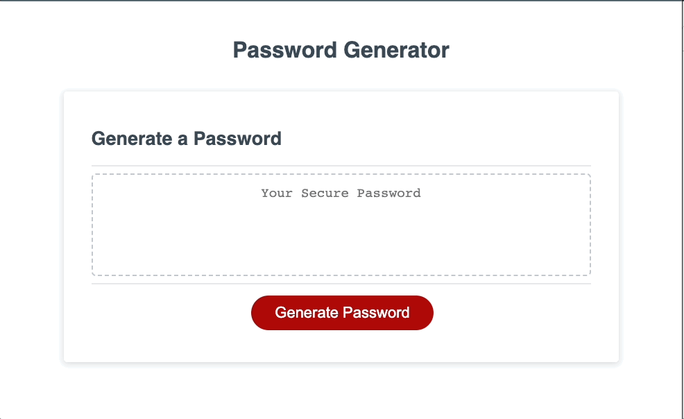

# Password Generator

## Technology Used 

| Technology Used         | Resource URL           | 
| ------------- |:-------------:| 
|  JavaScript | [https://developer.mozilla.org/en-US/docs/Web/JavaScript](https://developer.mozilla.org/en-US/docs/Web/JavaScript)     |  
|  HTML    | [https://developer.mozilla.org/en-US/docs/Web/HTML](https://developer.mozilla.org/en-US/docs/Web/HTML) | 
|  CSS     | [https://developer.mozilla.org/en-US/docs/Web/CSS](https://developer.mozilla.org/en-US/docs/Web/CSS)      |   
|  Git | [https://git-scm.com/](https://git-scm.com/)     |    


## Description 

[Visit the Deployed Site](https://mccoydidericksen.github.io/password-generator)

The purpose of this website is to supply users with a randomized password based on user selected criteria (like password length and what character types to include). Using JavaScript, the webpage will display a variety of prompts to the user about which rules their password needs to follow. After the user has given valid inputs, a series of logic is performed to generate the randomized password.

## Functionality

## Code Snippets

My initial approach to generating a random password based on user feedback consisted of two simple steps:

1. Create one large array of all possible characters determined by the user
2. Use a for loop (set to the length of desired password) and math.random to select random characters from the above set array

However, this purely random approach doesn't guarantee that all selected character types will be present in the final generated password. I needed to add additional logic to ensure that all required character types were included.

Step 1: Keep track of a list of indexes for each character type

```javascript
    var specialIndexList= [];
    var numberIndexList = [];
    var upperIndexList = [];
    var lowerIndexList = [];
    // Declare variable for random index
    var randomIndex = 0
    // Loop through password length
    for (var i = 0; i < passwordLength; i++) {
      // Generate random index based on length of possible characters
      // Use math.floor to round down to nearest whole number
      randomIndex = Math.floor(Math.random() * possibleCharacters.length);
      // Add character at random index to password characters
      passwordCharacters.push(possibleCharacters[randomIndex]);
      // Check if character is lowercase, uppercase, number, or special character
      // add to count variable and add index to index list
      if (lowercaseLetters.includes(possibleCharacters[randomIndex])) {
        lowerIndexList.push(i);
      }
      else if (uppercaseLetters.includes(possibleCharacters[randomIndex])) {
        upperIndexList.push(i);
      }
      else if (numbers.includes(possibleCharacters[randomIndex])) {
        numberIndexList.push(i);
      }
      else if (specialCharacters.includes(possibleCharacters[randomIndex])) {
        specialIndexList.push(i);
      }

    } 
```

Step 2: store character list information in an object

```javascript
    // create object to store character list information
    var charLists = {
      lower: {
        indexList: lowerIndexList,
        indexCount: lowerIndexList.length
      },
      upper: {
        indexList: upperIndexList,
        indexCount: upperIndexList.length
      },
      number: {
        indexList: numberIndexList,
        indexCount: numberIndexList.length
      }, 
      special: {
        indexList: specialIndexList,
        indexCount: specialIndexList.length
      },
    }
```

Step 3: if the specific character type is not included in the final password, choose an character index list that has at least 2 instances and replace one of the indexes with the in-question character type

```javascript
    // check if user selected special characters and if password contains special characters - add if not
    if (includeSpecial && passwordCharacters.every(r=> !specialCharacters.includes(r))) {
      console.log("adding special")
      var randomSpecialIndex = Math.floor(Math.random() * specialCharacters.length);
      var addSpecial = specialCharacters[randomSpecialIndex];
      // choose an indexList that has more than two list items
      for (i=0; i<Object.keys(charLists).length; i++) {
        if (charLists[Object.keys(charLists)[i]].indexCount > 1) {
          var selectedList = Object.keys(charLists)[i];
          // stops the for loop if a list is found
          break;
        }
      }
      // replace the chosen additional character to add with a valid character selection from the password
      var chosenIndex = charLists[selectedList].indexList[charLists[selectedList].indexList.length - 1];
      console.log(selectedList)
      console.log(chosenIndex)
      console.log(charLists[selectedList])
      passwordCharacters.splice(chosenIndex, 1, addSpecial);
      // update the selectedList values since we modified the password characters
      charLists[selectedList].indexCount -= 1;
      charLists[selectedList].indexList.pop();
    }
```
## Learning Points 

* It's easy to assume that your application works as expected when only testing certain scenarios - try to come up with possible edge cases and protect against them!
* There are a variety of different ways to perform the desired outcome, but there is usally a more efficient method than your first attempt
* Giving proper time and effort to reading the documentation on new technologies is crucial to project progress and quality